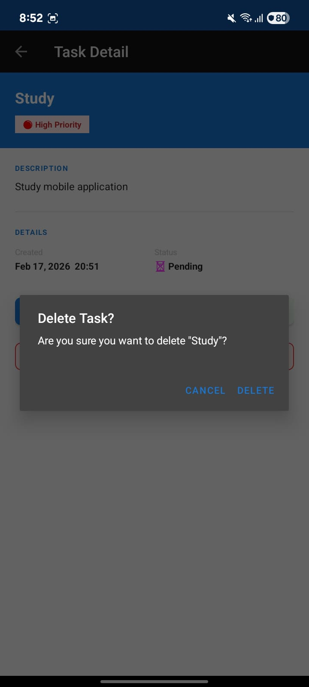
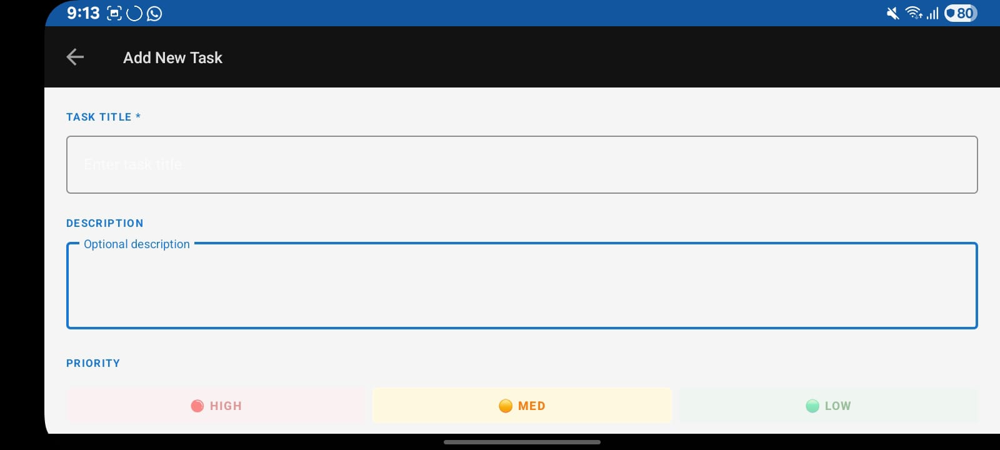
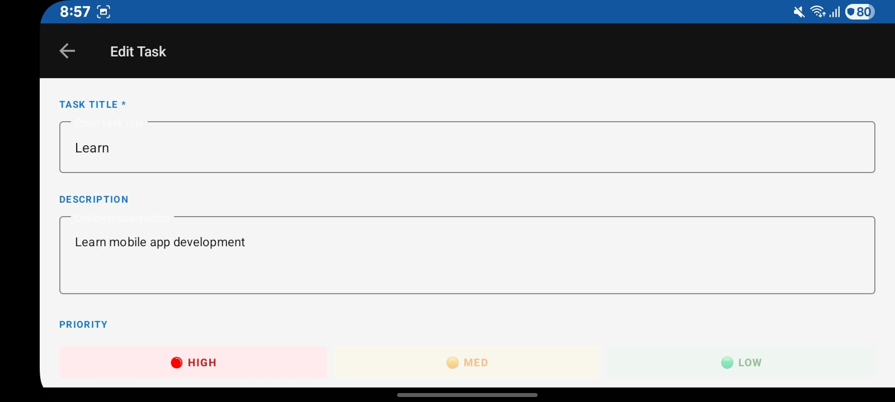
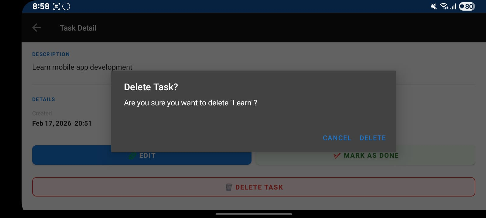

# 📱 Task Manager App
### SEN4302 — Mobile Application Development | Assignment 03

---

## App Description

A simple, clean Android task management app that lets users create, view, edit, and manage personal tasks/notes with full local data persistence.

---

## Features

| Feature | Status |
|---|---|
| Add new task (title, description, priority) | ✅ |
| View all tasks in RecyclerView list | ✅ |
| Edit existing task | ✅ |
| View full task detail | ✅ |
| Mark task as completed / incomplete | ✅ |
| Delete task with confirmation dialog | ✅ |
| Filter tasks: All / Active / Done | ✅ |
| Data persists after app restart | ✅ |
| Handles screen rotation (ViewModel) | ✅ |
| Empty state when no tasks exist | ✅ |
| Material Design UI | ✅ |

---

## Screenshots


### Portrait Screenshots

 **Task list screen**
1.  ) — Task list screen
2.    — Add new task screen
3.   — Update Task screen
4.   — Delete Task
5.   — Required Task

   ### Rotation Screenshots

1.   — Rotaction Task list screen
2.    — Rotaction Add new task screen
3.   — Rotaction Update Task screen
4.   — Rotaction Delete Task screen


---

## Architecture & Design Choices

### MVVM Architecture
The app uses the Model-View-ViewModel (MVVM) pattern:
- **Model** → `Task.kt`, `TaskRepository.kt`
- **View** → `MainActivity`, `AddEditTaskActivity`, `TaskDetailActivity` + XML layouts
- **ViewModel** → `TaskViewModel.kt`

This separation ensures the UI doesn't directly manage data, making the code cleaner and testable.

### Data Persistence — DataStore
I chose **DataStore Preferences** over SharedPreferences because:
- Modern, Kotlin-first API with Coroutines/Flow support
- Type-safe key access
- Asynchronous by default (no main-thread blocking)
- Recommended by Google as the successor to SharedPreferences

Tasks are serialized to JSON using **Gson** and stored as a single preferences key.

### ViewModel for State Management
`TaskViewModel` survives configuration changes (screen rotation). This means:
- The task list is never lost when rotating the device
- No redundant data re-loading

### RecyclerView + DiffUtil
`TaskAdapter` uses `ListAdapter` with `DiffUtil`, which:
- Calculates minimal changes between list updates
- Gives smooth, efficient animations
- Avoids full list redraws

### ViewBinding
All Activities use ViewBinding instead of `findViewById()`, which:
- Is null-safe at compile time
- Eliminates boilerplate
- Prevents runtime NullPointerExceptions

---


## Technical Stack

| Component | Technology |
|---|---|
| Language | Kotlin |
| Min SDK | API 26 (Android 8.0) |
| Target SDK | API 34 (Android 14) |
| UI | XML layouts + Material Components |
| Architecture | MVVM |
| State Management | ViewModel + LiveData |
| Data Persistence | DataStore Preferences |
| List Display | RecyclerView + DiffUtil |
| View References | ViewBinding |
| Async | Kotlin Coroutines |
| Serialization | Gson |

---

## How to Run

1. Clone or download this repository
2. Open the `TaskManager` folder in **Android Studio**
3. Wait for Gradle sync to complete
4. Connect a device or start an emulator (API 26+)
5. Click **Run ▶**

---

## Project Structure

```
TaskManager/
├── app/src/main/
│   ├── java/com/student/taskmanager/
│   │   ├── Task.kt                  ← Data model
│   │   ├── TaskRepository.kt        ← DataStore persistence
│   │   ├── TaskViewModel.kt         ← State management
│   │   ├── TaskAdapter.kt           ← RecyclerView adapter
│   │   ├── MainActivity.kt          ← Task list screen
│   │   ├── AddEditTaskActivity.kt   ← Add/Edit screen
│   │   └── TaskDetailActivity.kt    ← Detail screen
│   └── res/
│       ├── layout/
│       │   ├── activity_main.xml
│       │   ├── activity_add_edit_task.xml
│       │   ├── activity_task_detail.xml
│       │   └── item_task.xml
│       └── values/
│           ├── colors.xml
│           ├── strings.xml
│           └── themes.xml
└── README.md
```
### Student ID & Name
- Student Id = 11174
- Student Name = H A U P Kumarasinghe
